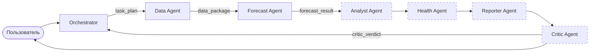

# AirQ-KZ — многоагентная ИИ-система качества воздуха в городах Казахстана

**Студент:** _ФИО_, группа _____ · **Курс:** _____ · **Этап:** Ассайнмент 2 (проектирование и прототип)

Пользователь спрашивает на естественном языке: *«Какой будет воздух завтра в Алматы?»*,
*«Можно ли послезавтра гулять с ребёнком в Астане?»*. Команда LLM-агентов собирает данные о
загрязнении и погоде, прогнозирует PM2.5 собственной ML-моделью и сверяет прогноз с моделью CAMS,
объясняет причины, даёт рекомендации и проверяет итоговый ответ.

## Документация для сдачи

| Раздел | Файл |
|---|---|
| Тема и обоснование многоагентности | [docs/01_topic.md](docs/01_topic.md) |
| Архитектура, схема взаимодействия, надёжность | [docs/02_architecture.md](docs/02_architecture.md) |
| Спецификация агентов: роли, входы, выходы, инструменты, критерии завершения | [docs/03_agents.md](docs/03_agents.md) |
| Форматы сообщений (JSON) | [docs/04_messages.md](docs/04_messages.md) |
| Сбалансированность ролей (≤ 40% вызовов) | [docs/05_load_balance.md](docs/05_load_balance.md) |
| ML-модель прогноза и её метрики | [docs/06_forecast_model.md](docs/06_forecast_model.md) |

## Архитектура кратко



| Агент | Роль | Инструменты | Статус |
|---|---|---|---|
| Orchestrator | понимает запрос, строит план | — | ✅ |
| Data Agent | собирает и проверяет данные | Open-Meteo: геокодинг, качество воздуха, погода | ✅ |
| Forecast Agent | прогноз PM2.5 на 0–3 дня | своя ML-модель, прогноз CAMS | ✅ |
| Analyst Agent | объясняет причины загрязнения | корреляции, сезонная норма, инверсии | Ассайнмент 4 |
| Health Agent | рекомендации для групп риска | нормы ВОЗ, шкала AQI | Ассайнмент 4 |
| Reporter Agent | пишет итоговый ответ | — | Ассайнмент 4 |
| Critic Agent | проверяет ответ | сверка чисел, обязательные части | Ассайнмент 4 |

**Что работает в прототипе:** веб-интерфейс и CLI; Orchestrator → Data Agent → Forecast Agent обмениваются
типизированными JSON-сообщениями. Работают лимиты шагов и времени, защита от зацикливания,
повторы и кэш для API, проверка ответов LLM по схеме, логирование каждого вызова и подсчёт
нагрузки на агентов.

## Запуск

Требуется Python 3.11+.

```bash
python -m venv .venv
.venv\Scripts\activate          # Windows (Linux/macOS: source .venv/bin/activate)
pip install -r requirements.txt
copy .env.example .env          # Linux/macOS: cp .env.example .env
```

Откройте `.env` и выберите LLM (примеры в `.env.example`):

- **Gemini — бесплатно, проверено:** ключ на aistudio.google.com → Get API key; в `.env` укажите
  `LLM_PROVIDER=openai`, `LLM_MODEL=gemini-3.5-flash`,
  `OPENAI_BASE_URL=https://generativelanguage.googleapis.com/v1beta/openai/`, `OPENAI_API_KEY=<ключ>`.
  Бесплатный тариф ограничивает число запросов в минуту (система сама подождёт 10–30 секунд
  и повторит запрос) и в день: у `gemini-3.5-flash` — 20 запросов, т.е. около 3 запусков.
  У каждой модели своя квота: когда она закончится, система сообщит об этом —
  переключитесь на `gemini-3.5-flash-lite` или подождите до следующего дня.
- **Claude:** `LLM_PROVIDER=anthropic`, `ANTHROPIC_API_KEY=<ключ>`.
- Другие OpenAI-совместимые провайдеры (OpenAI, Groq, локальная Ollama) — через `OPENAI_BASE_URL`.

Данные о воздухе и погоде берутся из Open-Meteo бесплатно и без ключа.

Обученная модель уже лежит в `models/`. Переобучить:

```bash
python scripts/train_forecast_model.py            # на сохранённых данных data/training_daily.csv
python scripts/train_forecast_model.py --refresh  # заново скачать историю (несколько минут)
```

## Веб-интерфейс (для демонстрации)

```bash
python -m streamlit run app.py
```

Откроется браузер (http://localhost:8501). В интерфейсе видно:

- схему из 7 агентов: подсвечивается, кто сейчас работает, кто закончил, кто не нужен для этого запроса
  и кто появится в Ассайнменте 4; под каждым агентом — счётчик вызовов LLM и инструментов;
- ход работы в реальном времени и план Orchestrator'а;
- ответ: текущее значение, прогноз по дням и график (PM2.5 CAMS по часам, ML-прогноз с 80%-интервалом,
  норма ВОЗ);
- JSON-сообщения между агентами, нагрузку на каждого агента с линией лимита 40% и журнал вызовов.

Режим **«Повтор сохранённого прогона»** проигрывает готовый запуск по логу — без интернета и без
расхода квоты LLM. В нём доступны примеры из `examples/` и все ваши запуски из `runs/`.

## Пример использования (консоль)

```bash
python main.py "Какой будет воздух завтра в Алматы?"
python main.py --json "Можно ли послезавтра гулять с ребёнком в Астане?"
python main.py -q "Какой сейчас воздух в Шымкенте?"
```

Во время работы печатается ход агентов. Реальный прогон на Gemini 3.5 Flash:

```text
$ python main.py "Какой будет воздух завтра в Алматы?"
[   6.8s] orchestrator    LLM #1 → финальный ответ (5.03s)
[   6.8s] orchestrator    ✉ task_plan → data_agent
[   8.4s] data_agent      LLM #1 → geocode_city (1.5s)
[   8.4s] data_agent        tool geocode_city [ok] (0.0s)
[   9.7s] data_agent      LLM #2 → fetch_air_quality, fetch_weather (1.36s)
[  10.3s] data_agent        tool fetch_air_quality [ok] (0.6s)
[  10.9s] data_agent        tool fetch_weather [ok] (0.54s)
[  14.5s] data_agent      LLM #3 → финальный ответ (3.67s)
[  14.5s] data_agent      ✉ data_package → forecast_agent
[  16.2s] forecast_agent  LLM #1 → run_ml_forecast, get_cams_forecast (1.64s)
[  21.4s] forecast_agent    tool run_ml_forecast [ok] (5.22s)
[  21.4s] forecast_agent    tool get_cams_forecast [ok] (0.0s)
[  26.1s] forecast_agent  LLM #2 → финальный ответ (4.72s)
[  26.1s] forecast_agent  ✉ forecast_result → user
[  26.1s] dispatcher      task_done

======================================================================
Город: Алматы (43.2525, 76.9115)
Последнее значение: 2026-10-06 15:00:00 — PM2.5 8.7 мкг/м³
Данные: Загружены почасовые данные о качестве воздуха и погоде для Алматы за период с 28 сентября
по 8 октября 2026 года без пропусков. Последнее наблюдаемое значение PM2.5 на 15:00 6 октября
составляет 8.7 мкг/м³.

Прогноз среднесуточного PM2.5 (мкг/м³):
  2026-10-06: 13.2 — умеренно (источник: blend, уверенность: medium; ML 15.5 [8.7–22.0]; CAMS 10.8)
  2026-10-07: 16.2 — умеренно (источник: blend, уверенность: high; ML 16.9 [9.3–24.9]; CAMS 15.6)
Обоснование: Для обеих дат выбран метод blend, так как прогнозы ML-модели и CAMS близки по
значениям и отражают схожую динамику. Сходимость прогнозов высокая для 7 октября (разница 8%)
и умеренная для 6 октября (разница 36%) ...

[прототип] Агенты reporter_agent, critic_agent будут добавлены в Ассайнменте 4.
======================================================================

Распределение нагрузки (всего вызовов: 11, лимит 40% на агента):
  data_agent      LLM  3 + инструменты  3 =  6  (55%)
  forecast_agent  LLM  2 + инструменты  2 =  4  (36%)
  orchestrator    LLM  1 + инструменты  0 =  1  (9%)
```

После каждого запуска в `runs/<task_id>/` сохраняются:

- `log.jsonl` — все вызовы LLM и инструментов, сообщения, ошибки (с временем и токенами);
- `state.json` — план, все сообщения между агентами, результаты агентов;
- `datasets/*.csv` — загруженные почасовые данные;
- `load_report.json` — доля вызовов каждого агента.

## Тесты

```bash
python -m pytest
```

36 тестов работают без сети и без ключа: вместо LLM подставляется сценарий, вместо Open-Meteo —
синтетические данные. Они проверяют обмен сообщениями Orchestrator → Data → Forecast,
валидацию плана, остановку при недоступных данных, повторы HTTP и переход на устаревший кэш,
исправление невалидного ответа LLM, лимиты шагов и времени, обнаружение зацикливания,
логирование вызовов, отклонение завышенной уверенности прогноза, а также адаптер LLM
(ожидание при поминутном лимите, быстрый отказ при дневном, служебные поля Gemini).

## Структура репозитория

```text
air-quality-agents/
├── main.py                     # CLI
├── app.py                      # веб-интерфейс (Streamlit)
├── aq_agents/
│   ├── agents/                 # Orchestrator, Data Agent, Forecast Agent
│   ├── llm/                    # адаптеры LLM: Claude (anthropic SDK), OpenAI-совместимые
│   ├── tools/                  # Open-Meteo, HTTP с повторами и кэшем, признаки, ML-модель, AQI
│   ├── runtime.py              # цикл агента: LLM ↔ инструменты, лимиты, проверка ответа
│   ├── pipeline.py             # диспетчер: выполняет план и доставляет сообщения
│   ├── messages.py             # схемы всех сообщений (Pydantic)
│   ├── state.py                # общее состояние задачи
│   ├── logger.py               # JSONL-логи и подсчёт нагрузки
│   └── config.py               # настройки из .env
├── scripts/
│   ├── train_forecast_model.py # обучение ML-модели
│   └── load_report.py          # распределение нагрузки по логу
├── models/                     # обученная модель + паспорт с метриками
├── data/training_daily.csv     # обучающие данные (8 городов, 2023–2026)
├── examples/run_health_astana/ # логи реального прогона на Gemini (log.jsonl, state.json)
├── docs/                       # документация для сдачи
└── tests/
```

## План развития

- **Ассайнмент 4:** Analyst, Health, Reporter и Critic Agent; цикл доработки по вердикту критика;
  станции OpenAQ; 5+ тестовых сценариев с ожидаемыми результатами; логи типового сценария
  с долей каждого агента ≤ 40%.
- **Экзамен:** 10+ сценариев, оценка качества ответов, отчёт и презентация.

## Источники данных

- [Open-Meteo](https://open-meteo.com/) — Air Quality API (CAMS), Forecast API, Archive API (ERA5), Geocoding API.
- Шкала AQI по PM2.5 — US EPA (редакция 2024); суточный ориентир ВОЗ по PM2.5 — 15 мкг/м³ (2021).
