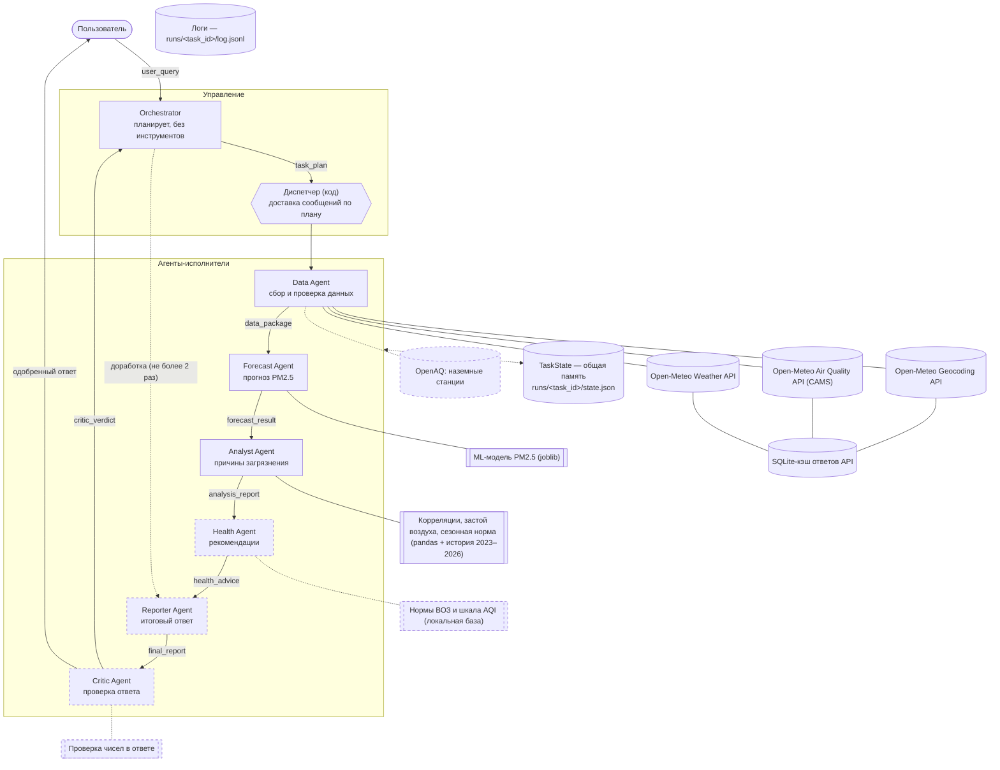
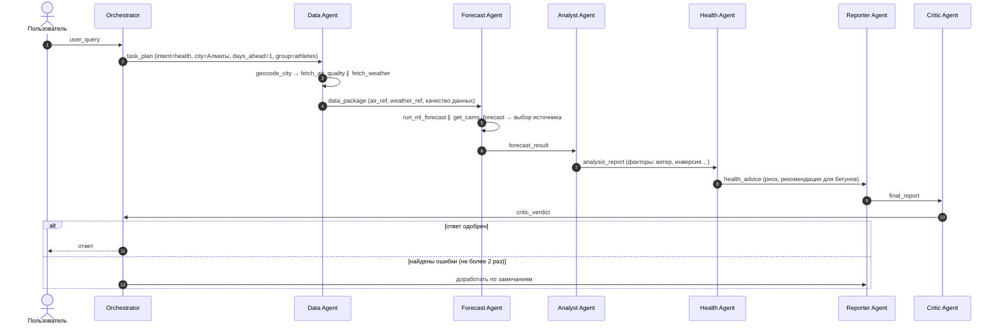

# 2. Архитектура

## Схема взаимодействия: оркестратор + конвейер по плану + общая память

- **Orchestrator** (LLM) только планирует: определяет тип запроса, город, горизонт, группу
  пользователей и упорядоченный список агентов. Предметной работы не выполняет, инструментов нет.
- **Диспетчер** (обычный код, не LLM) выполняет план: передаёт сообщение очередному агенту
  и адресует его ответ следующему агенту плана. Это конвейер, собранный под конкретный запрос.
- **Общая память (TaskState)** хранит план, все сообщения, почасовые наборы данных и результаты
  агентов. Большие таблицы не передаются в сообщениях: передаются ссылки (`air_ref`, `weather_ref`).
- **Обратная связь от критика:** вердикт Critic Agent возвращается Orchestrator'у, и тот решает,
  кого отправить на доработку. Доработок не больше двух, это защита от зацикливания.

## Схема агентов, связей и инструментов

Пунктир — агенты и инструменты Ассайнмента 4. Сплошная линия — уже реализовано в прототипе.

## Типовой сценарий (последовательность сообщений)

Запрос: *«Можно ли завтра утром бегать в Алматы?»*

В прототипе (Ассайнмент 2) работают шаги 1–6: Orchestrator → Data Agent → Forecast Agent → Analyst Agent.
Агенты, которых ещё нет, диспетчер пропускает и пишет в лог событие `agent_skipped`.

## Состояние задачи

| Что хранится | Где | Кто пишет |
|---|---|---|
| План задачи (`TaskPlan`) | `TaskState.plan` | Orchestrator |
| Все сообщения (конверт + payload) | `TaskState.messages` | Диспетчер |
| Почасовые данные воздуха и погоды | `TaskState` + `runs/<id>/datasets/*.csv` | Инструменты Data Agent |
| Результат каждого агента | `TaskState.results` | Диспетчер |
| Итог задачи | `runs/<id>/state.json` | В конце задачи, в том числе при ошибке |
| Кэш ответов API | `data/cache.sqlite` | HTTP-слой |

## Надёжность и безопасность

| Механизм | Где реализован | Значение по умолчанию |
|---|---|---|
| Лимит вызовов LLM внутри агента | `runtime.BaseAgent.run` | `MAX_AGENT_STEPS=6` |
| Общий лимит шагов (LLM + инструменты) на задачу | `runtime.Budget` | `MAX_TOTAL_STEPS=40` |
| Лимит времени на задачу | `runtime.Budget` | `TASK_TIMEOUT_S=180` |
| Защита от зацикливания: третий одинаковый вызов инструмента — остановка | `runtime._run_tool` | 2 повтора |
| Ответ модели не прошёл проверку схемы или правил — замечание и повтор | `runtime.BaseAgent.run` | до 2 исправлений |
| Повторы HTTP с экспоненциальной паузой (сеть, 429, 5xx) | `tools/http.get_json` | 3 попытки |
| Кэш API и переход на устаревший кэш при недоступности | `tools/http.get_json` | TTL 1 час |
| Повторы запросов к LLM (429, 5xx, сеть) | SDK провайдера | 3 попытки |
| Ошибка инструмента не роняет систему: возвращается агенту с `is_error` | `runtime._run_tool` | — |
| Понятное сообщение пользователю при сбое | `pipeline.run_task` → `render_answer` | — |
| Логирование всех вызовов LLM и инструментов | `logger.RunLogger` → `log.jsonl` | — |
| Ключи API только в `.env` (в `.gitignore`), в коде ключей нет | `config.py` | — |
| Числа считает код, а не LLM (категории, итоговый прогноз, пропуски) | `finalize()` агентов | — |

## Технологии

- Python 3.11+ и собственный минимальный «движок» агентов без фреймворков: каждую строку
  можно объяснить на защите.
- LLM: любая модель с вызовом инструментов, выбирается в `.env`: Claude (`claude-opus-5-5`,
  официальный SDK `anthropic`) или OpenAI-совместимые API (Gemini, OpenAI, Groq, локальная Ollama).
  Прототип проверен на Gemini 3.5 Flash (бесплатный тариф).
- Данные: Open-Meteo (бесплатно, без ключа). ML: scikit-learn. Валидация сообщений: Pydantic.
- Интерфейс: веб-интерфейс на Streamlit (`app.py`: схема агентов в реальном времени, графики, сообщения,
  нагрузка; режим повтора сохранённого прогона) и CLI (`main.py`).
